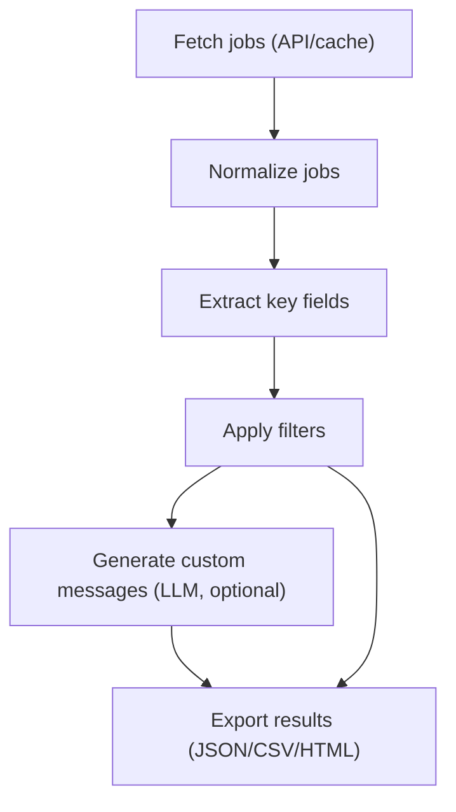

## LLM-powered custom job-fit messages

### Overview

- **Goal**: When enabled in `config.yaml`, generate a 3–5 line, first-person “why I’m a strong fit” message for each filtered job, based on your CV files under `doc/cv` and the job description, and surface it **only in the exports** (JSON, CSV, HTML) for easy copy/paste during applications.
- **Activation**: Controlled entirely by YAML and env vars:
  - `custom_message_enabled` – boolean toggle.
  - `custom_message_cv` – list of CV filenames under `doc/cv`.
  - `custom_message_system_prompt` – required system prompt text (no code defaults).
  - `custom_message_instructions` – required instructions text for the user prompt (no code defaults).
  - `custom_message_max_jobs` – optional cap on how many jobs per search get a **fresh** custom message (cached messages are unlimited).
- **Interactive mode**: **No additional prompts**. If the fields are configured in `config.yaml`, the feature runs; otherwise it is skipped. The CLI does not ask about any of these settings.
- **Console output**: **Unchanged**. Custom messages are **not** printed in the console summaries, only in file exports.
- **Caching**: Custom messages are cached per job and “profile” (CV + prompts). Cached messages are always reused when available (with a status flag), even when generation is disabled or unavailable, to minimise LLM usage.



---

## Config and preferences

### `config.yaml` additions

Under the existing fields, add a commented section such as:

- **Core flags and CV files**

- `custom_message_enabled: false`  
  - When `true`, the app will attempt to generate custom messages via the LLM step.
  - When `false` or missing, the run behaves as today (no LLM calls, no custom messages).

- `custom_message_cv: []`  
  - List of filenames (strings) in `doc/cv` to use as CV sources.
  - Example:

    ```yaml
    custom_message_enabled: true
    custom_message_cv:
      - "main_cv.md"
      - "projects.md"
    ```

- **Prompt customisation (required when enabled)**

- `custom_message_system_prompt: ""`  
  - Required when `custom_message_enabled: true`.
  - Must contain the full system prompt text for the LLM.
  - If `custom_message_enabled` is true and this field is missing or empty, the program should abort early with a clear error message instructing the user to populate it in `config.yaml`.

- `custom_message_instructions: ""`  
  - Required when `custom_message_enabled: true`.
  - Must contain the full “instructions” section of the user prompt (format, style, 3–5 lines, etc.).
  - If `custom_message_enabled` is true and this field is missing or empty, the program should abort early with a clear error message instructing the user to populate it in `config.yaml`.

- **Usage cap**

- `custom_message_max_jobs: 0` (optional)  
  - `0` or missing → no explicit cap (generate for all filtered jobs, subject to any internal safeguards).
  - Positive integer `N` → generate custom messages only for the **first N filtered jobs** in that run (cached messages are not limited).

These fields are **not** prompted for in interactive mode; they’re purely configuration-driven.

### `SearchPreferences` (`src/config.py`)

Extend the dataclass:

- Existing fields stay as-is.
- Add:

```python
custom_message_enabled: bool = False
custom_message_cv: list[str] = field(default_factory=list)
custom_message_system_prompt: str | None = None
custom_message_instructions: str | None = None
custom_message_max_jobs: int | None = None
```

#### YAML loading (`load_preferences_from_yaml`)

- Parse `custom_message_enabled` with a helper:

  - Accept typical YAML booleans and strings like `"true"`, `"yes"`, `"1"` → `True`; `"false"`, `"no"`, `"0"` → `False`.
  - On missing or invalid input, default to `False`.

- Parse `custom_message_cv`:

  - Accept either a scalar string or a sequence.
  - Normalise into `list[str]` of non-empty, stripped filenames (no path joining here).

- Parse `custom_message_system_prompt` and `custom_message_instructions`:

  - If key is missing or the string is empty/whitespace → store `None`.
  - Otherwise store the stripped string.

- Parse `custom_message_max_jobs`:

  - Try to coerce to an integer.
  - If value is `None` or invalid → store `None`.
  - If value is negative → treat as `None` (i.e. ignore).
  - If value is `0` → treat as “no explicit cap” (equivalent to `None`).
  - If value is positive → store the integer.

- **Validation when `custom_message_enabled` is true** (later, e.g. in `main.py` or `attach_custom_messages`):

  - Both `custom_message_system_prompt` and `custom_message_instructions` **must** be non-empty.
  - If either is `None` or empty at that point, print a clear message (for example, “custom_message_enabled is true but custom_message_system_prompt/custom_message_instructions are not set in config.yaml”) and abort the run before calling the API or generating results.

#### Interactive collection (`collect_preferences`)

- **Do not add any prompts** for:

  - `custom_message_enabled`
  - `custom_message_cv`
  - `custom_message_system_prompt`
  - `custom_message_instructions`
  - `custom_message_max_jobs`

- Simply:

  - Pass through `defaults.custom_message_*` into the returned `SearchPreferences` instance (when defaults exist).
  - Or use the default values defined on the dataclass when interactive-only (no YAML).

---

## LLM client and CV handling

### New module: `src/llm_client.py`

Use `requests` (already in `requirements.txt`) and OpenRouter.

- **Configuration via environment** (compatible with `python-dotenv`):

  - `OPENROUTER_API_KEY` – required for the feature to work.
  - `OPENROUTER_MODEL` – e.g. `"gpt-4.1-mini"` or another OpenRouter-supported model.
  - Optional: `OPENROUTER_BASE_URL` (defaults to `https://openrouter.ai/api/v1/chat/completions`).

- **Public function** (suggested signature):

```python
def generate_custom_message(
    job: dict[str, Any],
    cv_text: str,
    prefs: SearchPreferences,
    max_lines: int = 5,
) -> str | None:
    ...
```

Responsibilities:

- Build OpenRouter `messages` payload:

  - **System message**:

    - Use `prefs.custom_message_system_prompt`. Configuration validation guarantees that when `custom_message_enabled` is true this field is non-empty; there are **no hard-coded defaults** in code.

  - **User message** composed of three sections:

    1. **CV** – concatenated CV text.
    2. **Job** – title, company, location, key requirements, and truncated job description.
    3. **Instructions** – use `prefs.custom_message_instructions`. Configuration validation guarantees that when `custom_message_enabled` is true this field is non-empty; there are **no hard-coded defaults** in code.

- Set conservative parameters:

  - `temperature` around `0.5`.
  - `max_tokens` tuned to keep the output roughly within 3–5 lines (e.g. 200–300 tokens).

- Perform HTTP POST to OpenRouter with auth headers.

- On any error (missing API key, HTTP error, JSON parse error, etc.):

  - Log/print a concise warning.
  - Return `None` (do **not** crash the pipeline).

### CV loading helper

Either in `llm_client` or in a separate helper module:

- Implement `load_cv_text(cv_files: list[str]) -> str`:

  - For each filename in `cv_files`, construct `Path("doc") / "cv" / name`.
  - Attempt to read as UTF‑8.
  - Concatenate successfully read files with a clear separator like `"\n\n---\n\n"`.
  - For missing/unreadable files:

    - Print a warning including the filename.
    - Skip that file; continue with others.

  - If no files are readable:

    - Return an empty string.

- Cache the concatenated CV text in memory for the run so it’s not re-read per job.

---

## Custom message caching and generation

### Profile key and cache files

- **Profile key**: represent the current “profile” (CV + prompts) as a stable hash:

```python
profile_input = (
    cv_text
    + "\n\n---SYSTEM---\n\n"
    + effective_system_prompt
    + "\n\n---INSTRUCTIONS---\n\n"
    + effective_instructions
)
profile_key = sha256(profile_input.encode("utf-8")).hexdigest()
```

- **Job identifier**:

  - Prefer `job_id` from the `_raw` payload (JSearch ID).
  - If missing, derive a synthetic ID, e.g.:

    ```python
    fingerprint = f"{title}||{company}||{link}||{country}"
    job_id = sha256(fingerprint.encode("utf-8")).hexdigest()
    ```

- **Cache location and format**:

  - Directory: `debug/custom-messages/`.
  - One JSON file per job: `debug/custom-messages/<job_id>.json`.
  - Structure:

    ```json
    {
      "job_id": "JSEARCH_JOB_ID_123",
      "profiles": [
        {
          "profile_key": "HASH_OF_CV+PROMPTS_V1",
          "message": "3–5 line message...",
          "created_at": "2026-02-26T13:45:00Z"
        },
        {
          "profile_key": "HASH_OF_CV+PROMPTS_V2",
          "message": "Message generated after prompt change...",
          "created_at": "2026-03-01T09:00:00Z"
        }
      ]
    }
    ```

- Caching is **per job_id**. When a completely different job appears (different `job_id` or different fingerprint), it naturally gets a different cache file and no prior messages are reused.

### Cache lookup semantics

- Define a helper returning both a message and a status:

```python
@dataclass
class CacheResult:
    message: str | None
    status: str  # "cached_same_profile" | "cached_inconsistent_profile" | "none"
```

- Lookup rules for a given `job_id` and current `profile_key`:

  - If no cache file for this `job_id` exists → `CacheResult(message=None, status="none")`.
  - If a profile entry with the same `profile_key` exists and has a message → return that message with `status="cached_same_profile"`.
  - Otherwise, if any prior profile entries exist with messages:
    - Choose the most recent (by `created_at`).
    - Return that message with `status="cached_inconsistent_profile"` (job id matches, profile changed).
  - Otherwise → `CacheResult(message=None, status="none")`.

### Status values

- For **messages present**:

  - `fresh` – message generated in this run by the LLM.
  - `cached_same_profile` – reused from cache; job ID and profile key match current CV + prompts.
  - `cached_inconsistent_profile` – reused from cache; job ID matches but profile key differs from current CV + prompts.

- For **no message text**:

  - `unavailable_disabled` – `custom_message_enabled` is `false` and no cached message exists.
  - `unavailable_no_cv` – no usable CV text could be loaded and no cached message exists.
  - `unavailable_llm` – LLM not available (e.g. missing API key) and no cached message exists.
  - `unavailable_max_jobs` – job is beyond `custom_message_max_jobs` for new calls and no cached message exists.
  - `unavailable_error` – LLM error for this job specifically and no cached message exists.

- **Guarantee**: every job gets **both** fields:

  - `custom_message` (string; may be empty).
  - `custom_message_status` (one of the values above).

### New module: `src/custom_message.py`

Implement:

```python
def attach_custom_messages(
    jobs: list[dict[str, Any]],
    prefs: SearchPreferences,
) -> None:
    ...
```

Behaviour:

1. **Prepare run-level context**:

   - If `not prefs.custom_message_enabled`:

     - Do **not** attempt to call the LLM.
     - Still load cached messages (see below) so that previously generated messages can be surfaced with appropriate status.

   - Load CV text via `load_cv_text(prefs.custom_message_cv)`:

     - If no files are readable, remember this as a “no CV” condition (`cv_text` empty).

   - Resolve effective prompts (system + instructions) from `prefs`.

     - When `custom_message_enabled` is true, validation before this step must ensure both fields are non-empty; otherwise the program should have aborted earlier.

   - Compute the `profile_key` from CV text + prompts.
   - Detect LLM availability (e.g. OpenRouter API key present) and store a boolean `llm_available`.
   - Compute the **fresh-call cap**:

     ```python
     if prefs.custom_message_max_jobs and prefs.custom_message_max_jobs > 0:
         max_jobs = prefs.custom_message_max_jobs
     else:
         max_jobs = None  # no explicit cap on fresh calls
     fresh_calls_so_far = 0
     ```

2. **Iterate over filtered jobs** (input list is the already-filtered jobs, currently `filtered` in `main.py`):

   - For each job:

     - Determine `job_id` (real or fallback hash).

     - **Try cache first**:

       - Call the cache helper to get `CacheResult(message, status)`.
       - If `message` is non-empty:

         - Set:

           ```python
           job["custom_message"] = message
           job["custom_message_status"] = status  # "cached_same_profile" or "cached_inconsistent_profile"
           ```

         - **Do not call the LLM** for this job, regardless of any other conditions (disabled, errors, caps, etc.).
         - Continue to the next job.

     - **Decide whether a fresh LLM call is allowed** (only when no cached message was found):

       ```python
       can_call_llm = (
           prefs.custom_message_enabled
           and cv_text.strip()
           and llm_available
           and (max_jobs is None or fresh_calls_so_far < max_jobs)
       )
       ```

     - If `can_call_llm`:

       - Build a compact job context (role, employer, location, location_type, position_type, minimum_salary, tech_stack, requirements, truncated job description).
       - Call `generate_custom_message(job=..., cv_text=cv_text, prefs=prefs, ...)`.
       - If a non-empty string is returned:

         ```python
         job["custom_message"] = message
         job["custom_message_status"] = "fresh"
         save_to_cache(job_id, profile_key, message)
         fresh_calls_so_far += 1
         ```

       - If the LLM call fails or returns empty:

         ```python
         job["custom_message"] = ""
         job["custom_message_status"] = "unavailable_error"
         ```

     - If **not** `can_call_llm` and no cached message exists:

       - Do **not** call the LLM.
       - Set `custom_message` to an empty string and `custom_message_status` to a reason-specific value:

         ```python
         if not prefs.custom_message_enabled:
             status = "unavailable_disabled"
         elif not cv_text.strip():
             status = "unavailable_no_cv"
         elif not llm_available:
             status = "unavailable_llm"
         elif max_jobs is not None and fresh_calls_so_far >= max_jobs:
             status = "unavailable_max_jobs"
         else:
             status = "unavailable_error"

         job["custom_message"] = ""
         job["custom_message_status"] = status
         ```

3. **Key guarantees**:

   - **Cached messages are always reused** when present, even if:
     - `custom_message_enabled` is `False`,
     - the LLM is misconfigured/unavailable,
     - the job is beyond `custom_message_max_jobs`,
     - or any other error occurs.
   - The cache is **per job_id**; different jobs never share messages.
   - When the profile changes, cached messages for that job are still used but clearly marked as `cached_inconsistent_profile` so the user can decide whether to trust them.

---

## Wiring into the main pipeline

### `main.py`

- Import the new module:

```python
from src.custom_message import attach_custom_messages
```

- After filtering (i.e. after `filtered = filter_jobs(extracted, prefs)` and before printing summaries and exporting), insert:

```python
if filtered:
    attach_custom_messages(filtered, prefs)
```

- The rest of the logic stays the same:

  - Console uses `print_summaries(filtered)` – **no changes** to include the custom message.
  - Exports use `filtered` with possible `custom_message` and `custom_message_status` keys attached.

---

## Output changes

### Console summaries (`src/summary.py`)

- **Do not** change `build_summary` or `print_summaries` to show `custom_message`.

- Console output remains exactly as before.

### JSON export (`export_json`)

- The current implementation copies all keys except `_raw`, so both `custom_message` and `custom_message_status` will be included automatically once attached.

### CSV export (`export_csv`)

- Extend the `keys` list to include `custom_message` and `custom_message_status`:

```python
keys = [
    "role", "employer_name", "location", "location_type", "position_type",
    "minimum_salary", "industry", "job_spec_language", "tech_stack",
    "requirements", "job_link", "custom_message", "custom_message_status",
]
```

- When building each row:

  - Ensure `custom_message` is converted to a string or `""`.
  - Ensure `custom_message_status` is always a string (one of the defined status values).
  - CSV writer will quote multi-line values; that’s acceptable for copy/paste.

### HTML export (`export_html`)

- For each job card, if `ex.get("custom_message")` is truthy, add a new section above the Apply button, e.g.:

```html
<div class="custom-message">
  <div class="custom-message-title">Custom message for this job</div>
  <textarea class="custom-message-box" readonly>...message...</textarea>
  <div class="custom-message-status">Status: fresh/cached/…</div>
</div>
```

- Extend the `<style>` block with simple rules:

  - `.custom-message` – margin and layout.
  - `.custom-message-title` – small heading.
  - `.custom-message-box` – monospace, full width, light background, resizable minimal, `readonly` for easy selection.
  - `.custom-message-status` – subtle status label (e.g. small, muted text indicating `fresh`, `cached_same_profile`, or `cached_inconsistent_profile`).

- Keep the file self-contained (no external CSS/JS).

---

## Prompting strategy and safety

### Prompts from `config.yaml` (no code defaults)

- **System prompt**:

  - Defined entirely in `custom_message_system_prompt` in `config.yaml`.
  - There are **no hard-coded defaults** in code; if the feature is enabled and this field is missing/empty, the run should abort early with a clear message.

- **Instructions**:

  - Defined entirely in `custom_message_instructions` in `config.yaml`.
  - There are **no hard-coded defaults** in code; if the feature is enabled and this field is missing/empty, the run should abort early with a clear message.

- Recommended content (to document in README, not as code defaults):

  - System prompt: career-coach style, instructing honesty, short first-person messages, no fabrication.
  - Instructions: 3–5 lines, first person, no greeting/sign-off, only CV-backed, job-relevant experience and skills, plain text, no bullets or markdown.

Users can refine both via YAML without touching the code.

### Error handling and cost control

- If the OpenRouter API key is missing or the API fails:

  - Log a one-time warning like:
    - “Custom message generation unavailable: OpenRouter API not configured/available.”
  - **Do not** attempt fresh LLM calls, but continue the run and still surface any cached messages (with `cached_*` status).

- Limit prompt size:

  - Truncate CV text (if it’s very long).
  - Truncate job description to a few thousand characters.
  - Respect `custom_message_max_jobs` from YAML for **fresh** LLM calls (cached messages are not limited).

- Consider short request timeouts and at most one retry to avoid hanging runs.

### Privacy note

- Document clearly (in `README.md`) that when `custom_message_enabled: true`, the app sends:

  - Your CV text from `doc/cv` and
  - Job descriptions

  to OpenRouter’s API.

---

## Documentation updates

- **README.md**

  - Add a section “Custom LLM Messages” describing:

    - Purpose of the feature.
    - The new config fields (`custom_message_enabled`, `custom_message_cv`, `custom_message_system_prompt`, `custom_message_instructions`, `custom_message_max_jobs`).
    - Required env vars for OpenRouter.
    - Where to find the messages (JSON, CSV, HTML) and that they are not printed in the console.

- **AGENTS.md**

  - Note the new modules and fields:

    - `SearchPreferences` new fields in `src/config.py`.
    - `src/llm_client.py` for OpenRouter integration.
    - `src/custom_message.py` for attaching messages and handling cache lookup.
    - Changes in `src/summary.py` (CSV, HTML) and `main.py`.

- **config.yaml comments**

  - Extend the header comments to briefly explain:

    - How to enable the feature.
    - How to specify CV files.
    - How to provide system prompt and instructions (no code defaults).
    - How to limit the number of jobs per run.

